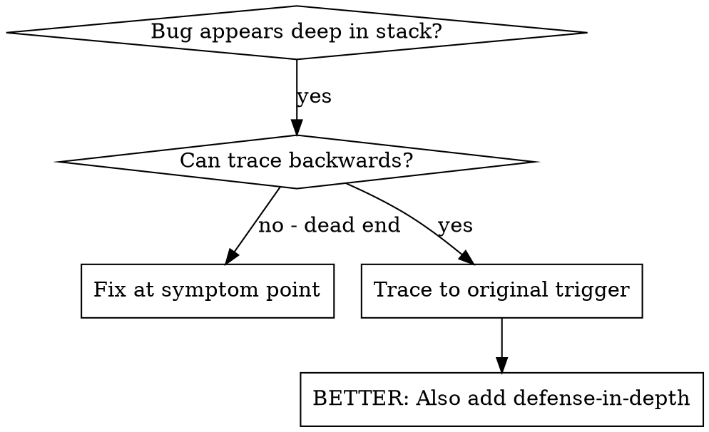
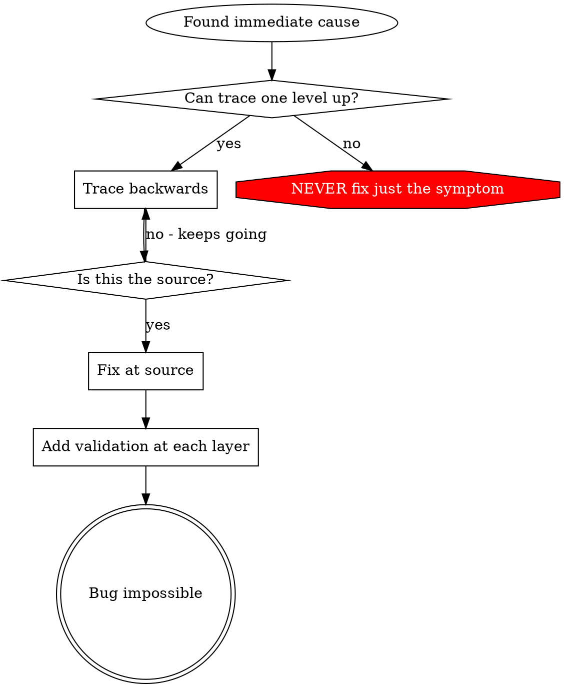
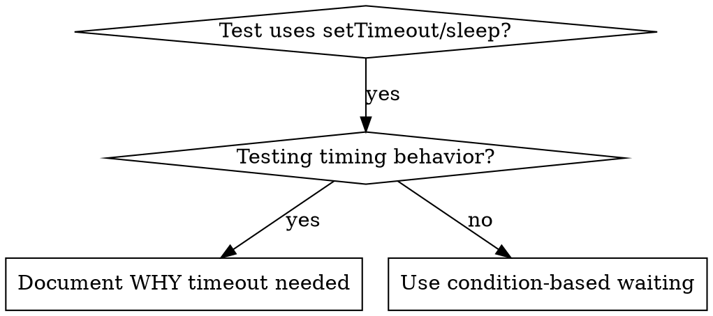

# Debugging Techniques

Three load-bearing techniques used across deep-debug phases. Ported with minor adaptation from superpowers' systematic-debugging supporting files; preserved largely verbatim because these are battle-tested and domain-independent.

- [Root Cause Tracing](#root-cause-tracing) — Phase 1, when symptom-site ≠ cause-site
- [Defense-in-Depth Validation](#defense-in-depth-validation) — Phase 5, after the fix verifies
- [Condition-Based Waiting](#condition-based-waiting) — Phase 5, when fixing timing-dependent or flaky tests

---

## Root Cause Tracing

### Overview

Bugs often manifest deep in the call stack (git init in wrong directory, file created in wrong location, database opened with wrong path). The instinct is to fix where the error appears, but that's treating a symptom.

**Core principle:** Trace backward through the call chain until you find the original trigger, then fix at the source.

### When to use



**Use when:**
- Error happens deep in execution (not at entry point)
- Stack trace shows long call chain
- Unclear where invalid data originated
- Need to find which test/code triggers the problem
- The symptom is the **data-flow** dimension's primary angle

### The tracing process

**1. Observe the symptom**
```
Error: git init failed in /Users/jesse/project/packages/core
```

**2. Find immediate cause**

What code directly causes this?
```typescript
await execFileAsync('git', ['init'], { cwd: projectDir });
```

**3. Ask: what called this?**
```typescript
WorktreeManager.createSessionWorktree(projectDir, sessionId)
  → called by Session.initializeWorkspace()
  → called by Session.create()
  → called by test at Project.create()
```

**4. Keep tracing up**

What value was passed?
- `projectDir = ''` (empty string!)
- Empty string as `cwd` resolves to `process.cwd()`
- That's the source code directory

**5. Find original trigger**

Where did the empty string come from?
```typescript
const context = setupCoreTest(); // Returns { tempDir: '' }
Project.create('name', context.tempDir); // Accessed before beforeEach!
```

### Adding stack traces

When you can't trace manually, add instrumentation:

```typescript
// Before the problematic operation
async function gitInit(directory: string) {
  const stack = new Error().stack;
  console.error('DEBUG git init:', {
    directory,
    cwd: process.cwd(),
    nodeEnv: process.env.NODE_ENV,
    stack,
  });

  await execFileAsync('git', ['init'], { cwd: directory });
}
```

**Critical:** Use `console.error()` in tests (not logger — may not show)

**Run and capture:**
```bash
npm test 2>&1 | grep 'DEBUG git init'
```

**Analyze stack traces:**
- Look for test file names
- Find the line number triggering the call
- Identify the pattern (same test? same parameter?)

### Finding which test causes pollution

If something appears during tests but you don't know which test, use a bisection:

```bash
# Pseudocode for bisection script
half=tests[0:len/2]
run_tests(half) && run_target()
  # if pollution appears: target depends on half
  # else: target depends on other half
# Recurse until single test isolated
```

A basic `find-polluter.sh` is available in the superpowers systematic-debugging skill directory — adapt it to your test runner.

### Real example: empty projectDir

**Symptom:** `.git` created in `packages/core/` (source code)

**Trace chain:**
1. `git init` runs in `process.cwd()` ← empty `cwd` parameter
2. WorktreeManager called with empty `projectDir`
3. Session.create() passed empty string
4. Test accessed `context.tempDir` before `beforeEach`
5. `setupCoreTest()` returns `{ tempDir: '' }` initially

**Root cause:** Top-level variable initialization accessing empty value

**Fix:** Made `tempDir` a getter that throws if accessed before `beforeEach`

**Also added defense-in-depth:**
- Layer 1: `Project.create()` validates directory
- Layer 2: `WorkspaceManager` validates not empty
- Layer 3: `NODE_ENV` guard refuses `git init` outside tmpdir
- Layer 4: Stack trace logging before `git init`

### Key principle



**NEVER fix just where the error appears.** Trace back to find the original trigger.

### Stack trace tips

- **In tests:** Use `console.error()` not logger — logger may be suppressed
- **Before operation:** Log before the dangerous operation, not after it fails
- **Include context:** Directory, cwd, environment variables, timestamps
- **Capture stack:** `new Error().stack` shows complete call chain

### Where this fits in deep-debug

- Primary mode of investigation for the **data-flow** dimension (Phase 2)
- Pre-Phase 5: before writing the fix, confirm you've traced to the source, not a downstream checkpoint
- Post-Phase 5: when adding defense-in-depth (see next section), each trace layer becomes a validation layer

---

## Defense-in-Depth Validation

### Overview

When you fix a bug caused by invalid data, adding validation at one place feels sufficient. But that single check can be bypassed by different code paths, refactoring, or mocks.

**Core principle:** Validate at EVERY layer data passes through. Make the bug structurally impossible.

### Why multiple layers

Single validation: "We fixed the bug"
Multiple layers: "We made the bug impossible"

Different layers catch different cases:
- Entry validation catches most bugs
- Business logic catches edge cases
- Environment guards prevent context-specific dangers
- Debug logging helps when other layers fail

### The four layers

#### Layer 1: Entry point validation
**Purpose:** Reject obviously invalid input at API boundary

```typescript
function createProject(name: string, workingDirectory: string) {
  if (!workingDirectory || workingDirectory.trim() === '') {
    throw new Error('workingDirectory cannot be empty');
  }
  if (!existsSync(workingDirectory)) {
    throw new Error(`workingDirectory does not exist: ${workingDirectory}`);
  }
  if (!statSync(workingDirectory).isDirectory()) {
    throw new Error(`workingDirectory is not a directory: ${workingDirectory}`);
  }
  // ... proceed
}
```

#### Layer 2: Business logic validation
**Purpose:** Ensure data makes sense for this operation

```typescript
function initializeWorkspace(projectDir: string, sessionId: string) {
  if (!projectDir) {
    throw new Error('projectDir required for workspace initialization');
  }
  // ... proceed
}
```

#### Layer 3: Environment guards
**Purpose:** Prevent dangerous operations in specific contexts

```typescript
async function gitInit(directory: string) {
  // In tests, refuse git init outside temp directories
  if (process.env.NODE_ENV === 'test') {
    const normalized = normalize(resolve(directory));
    const tmpDir = normalize(resolve(tmpdir()));

    if (!normalized.startsWith(tmpDir)) {
      throw new Error(
        `Refusing git init outside temp dir during tests: ${directory}`
      );
    }
  }
  // ... proceed
}
```

#### Layer 4: Debug instrumentation
**Purpose:** Capture context for forensics

```typescript
async function gitInit(directory: string) {
  const stack = new Error().stack;
  logger.debug('About to git init', {
    directory,
    cwd: process.cwd(),
    stack,
  });
  // ... proceed
}
```

### Applying the pattern

When a hypothesis is verified and the fix is in:

1. **Trace the data flow** — where does bad value originate? where used?
2. **Map all checkpoints** — list every point data passes through
3. **Add validation at each layer** — entry, business, environment, debug
4. **Test each layer** — try to bypass layer 1, verify layer 2 catches it

### Example from session

Bug: Empty `projectDir` caused `git init` in source code

**Data flow:**
1. Test setup → empty string
2. `Project.create(name, '')`
3. `WorkspaceManager.createWorkspace('')`
4. `git init` runs in `process.cwd()`

**Four layers added:**
- Layer 1: `Project.create()` validates not empty / exists / writable
- Layer 2: `WorkspaceManager` validates `projectDir` not empty
- Layer 3: `WorktreeManager` refuses `git init` outside tmpdir in tests
- Layer 4: Stack trace logging before `git init`

**Result:** All 1847 tests passed, bug impossible to reproduce

### Key insight

All four layers were necessary. During testing, each layer caught bugs the others missed:
- Different code paths bypassed entry validation
- Mocks bypassed business logic checks
- Edge cases on different platforms needed environment guards
- Debug logging identified structural misuse

**Don't stop at one validation point.** Add checks at every layer.

### Where this fits in deep-debug

- Phase 5 (Fix + Verify) — after the test passes, add defense-in-depth layers as part of the fix
- Phase 8 (Final Report) — the report's Defense-in-Depth Suggestions section recommends specific layers
- Defense-in-depth is not required to call a fix verified — but a fix without any defense-in-depth is one where the bug can recur via a different code path. The final report surfaces this risk explicitly.

---

## Condition-Based Waiting

### Overview

Flaky tests often guess at timing with arbitrary delays. This creates race conditions where tests pass on fast machines but fail under load or in CI.

**Core principle:** Wait for the actual condition you care about, not a guess about how long it takes.

### When to use



**Use when:**
- Tests have arbitrary delays (`setTimeout`, `sleep`, `time.sleep()`)
- Tests are flaky (pass sometimes, fail under load)
- Tests timeout when run in parallel
- Waiting for async operations to complete
- A **concurrency-timing** hypothesis was accepted and the fix involves test timing

**Don't use when:**
- Testing actual timing behavior (debounce, throttle intervals)
- Always document WHY if using arbitrary timeout

### Core pattern

```typescript
// ❌ BEFORE: Guessing at timing
await new Promise(r => setTimeout(r, 50));
const result = getResult();
expect(result).toBeDefined();

// ✅ AFTER: Waiting for condition
await waitFor(() => getResult() !== undefined);
const result = getResult();
expect(result).toBeDefined();
```

### Quick patterns

| Scenario | Pattern |
|----------|---------|
| Wait for event | `waitFor(() => events.find(e => e.type === 'DONE'))` |
| Wait for state | `waitFor(() => machine.state === 'ready')` |
| Wait for count | `waitFor(() => items.length >= 5)` |
| Wait for file | `waitFor(() => fs.existsSync(path))` |
| Complex condition | `waitFor(() => obj.ready && obj.value > 10)` |

### Implementation

Generic polling function:
```typescript
async function waitFor<T>(
  condition: () => T | undefined | null | false,
  description: string,
  timeoutMs = 5000
): Promise<T> {
  const startTime = Date.now();

  while (true) {
    const result = condition();
    if (result) return result;

    if (Date.now() - startTime > timeoutMs) {
      throw new Error(`Timeout waiting for ${description} after ${timeoutMs}ms`);
    }

    await new Promise(r => setTimeout(r, 10)); // Poll every 10ms
  }
}
```

For Python, the equivalent:
```python
import time

def wait_for(condition, description, timeout_s=5):
    start = time.time()
    while True:
        result = condition()
        if result:
            return result
        if time.time() - start > timeout_s:
            raise TimeoutError(f"Timeout waiting for {description} after {timeout_s}s")
        time.sleep(0.01)  # Poll every 10ms
```

### Common mistakes

**❌ Polling too fast:** `setTimeout(check, 1)` — wastes CPU
**✅ Fix:** Poll every 10ms

**❌ No timeout:** Loop forever if condition never met
**✅ Fix:** Always include timeout with clear error

**❌ Stale data:** Cache state before loop
**✅ Fix:** Call getter inside loop for fresh data

### When arbitrary timeout IS correct

```typescript
// Tool ticks every 100ms - need 2 ticks to verify partial output
await waitForEvent(manager, 'TOOL_STARTED'); // First: wait for condition
await new Promise(r => setTimeout(r, 200));   // Then: wait for timed behavior
// 200ms = 2 ticks at 100ms intervals - documented and justified
```

**Requirements:**
1. First wait for triggering condition
2. Based on known timing (not guessing)
3. Comment explaining WHY

### Where this fits in deep-debug

- Phase 5 (Fix + Verify) — when the accepted hypothesis is in the **concurrency-timing** dimension, the fix usually involves replacing arbitrary sleeps with condition-based waits
- Phase 0 reproduction step — when reproduction status is `intermittent`, the reproduction script probably has a `sleep()`; replace it with condition-based waiting to make the reproduction deterministic
- Related skill: `flaky-test-diagnoser` — if the symptom is "test is flaky", invoke that skill's workflow (bisection, ordering permutation, timing analysis) inside Phase 1 rather than re-implementing here

### Real-world impact

From a debugging session (source: superpowers):
- Fixed 15 flaky tests across 3 files
- Pass rate: 60% → 100%
- Execution time: 40% faster
- No more race conditions

---

## Cross-Reference Summary

| Technique | Primary phase | Secondary phase | Companion skill |
|-----------|---------------|-----------------|-----------------|
| Root cause tracing | Phase 1 (Evidence Gathering) + Phase 2 (data-flow hypothesis) | Phase 5 (before writing the fix) | — |
| Defense-in-depth | Phase 5 (after verified fix) | Phase 8 (Final Report suggestions) | — |
| Condition-based waiting | Phase 5 (concurrency-timing fix) | Phase 0 (deterministic reproduction) | `flaky-test-diagnoser` |
